<div align="center">
  

# 🛡️ C23_SDD_SSDLC: The Spec-Driven Development Framework


> *"Security by Design through Deterministric Spec-Driven AI Orchestration."*

</div>

---

## 🏛️ 1. Introduction: The Genesis of Governance

### 📜 The History of Architectural Decision Records (ADR)
The concept of **Architectural Decision Records (ADR)** was first proposed by **Michael Nygard** in 2011. Nygard recognized that the "why" behind architectural choices was often lost over time, leading to "architectural drift" and "technical debt." By capturing decisions in a lightweight, version-controlled format, teams could maintain a collective memory of the system's evolution.

The practice was later popularized by **Thoughtworks** in their Technology Radar, elevating ADRs from a niche blogging concept to a global standard for modern software engineering.

### 🎯 Spec-Driven Development (SDD): From Specs to AI
**Spec-Driven Development** traces its roots back to formal methods and the "Cleanroom Software Engineering" approach initiated by **Harlan Mills**. However, it was made famous in the web era by figures like **Joel Spolsky**, who advocated for "Functional Specifications" as a prerequisite for any code.

In 2026, C23_SDD_SSDLC evolves this paradigm for the **AI-Agentic Era**. With **Google Antigravity** and **Anthropic Claude Code**, SDD is no longer just about human documentation—it is about providing a **deterministic constraint system** that prevents AI "hallucinations" and ensures that every line of code adheres to a predefined "Source of Truth."

### 📈 Market Trends & Future Evolution (2026+)
Current trends in 2026 show a massive shift towards **"Self-Healing Architectures"** and **"GRC-as-Code"** (Governance, Risk, and Compliance). The market is moving away from manual prompts toward **Agentic Skills**—modular, reusable blocks of deterministic knowledge.

The future of C23_SDD_SSDLC lies in **Multi-Agent Orchestration**, where specialized agents (Security Guard, App Architect, QA Lead) negotiate within an SDD-constrained environment to produce zero-vulnerability code.

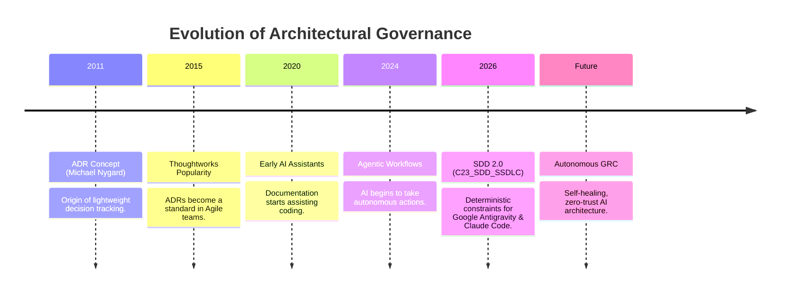

---

## 🧬 2. The SDD Operational Engine

C23_SDD_SSDLC employs a **Bottom-Up Sequential Flow**. AI operations are governed by a hierarchy of constraints where security and legal mandates (*Asimov’s Constraints*) take precedence over implementation speed.

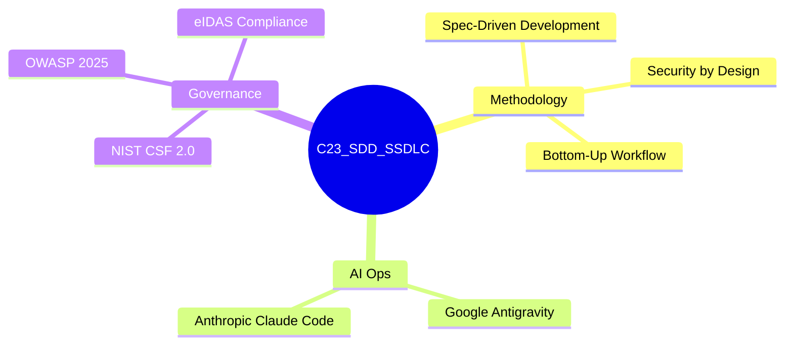

---

## 🏗️ 3. The Skills Ecosystem (Layered Architecture)

### 🌐 LAYER 0: THE ORCHESTRATOR
This layer defines the core policies of the SDD engine. It is the "Brain" that ensures all other skills are executed in the correct order and under the right constraints.

*   **Skill:** [`skill000_orchestrator.txt`](./.agents/skills/skill000_orchestrator.txt)
*   **Role:** System Architect
*   **Key Function:** Orchestrates the multi-agent workflow and resolves conflicts.

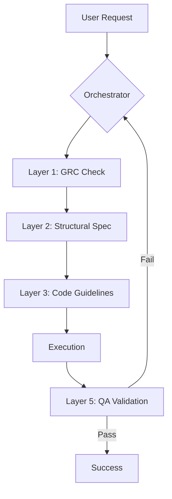

### ⚖️ LAYER 1: GRC (Governance, Risk, & Compliance)
Ensures the software is legally compliant and architecturally secure. It leverages **NIST CSF 2.0** and **ISO 27001:2022** frameworks.

*   **Skills:** 
    *   [`skill011_license.txt`](./.agents/skills/skill011_license.txt) (Legal Sentinel)
    *   [`skill012_security.txt`](./.agents/skills/skill012_security.txt) (SecOps Guard)

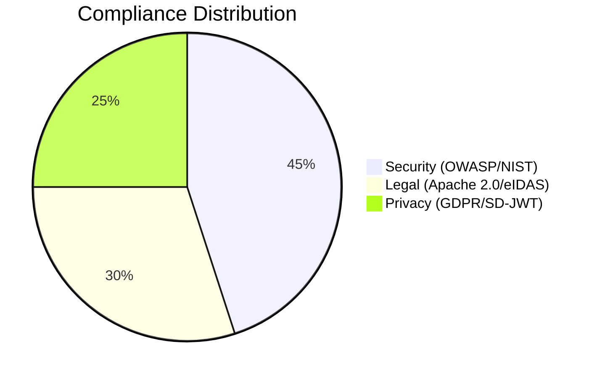

```mermaid
radar
    title Security Maturity Model
    labels [Injection, Authentication, Data Integrity, Logging, Encryption]
    data [0.9, 0.85, 0.95, 0.8, 0.9]
```

### 🛠️ LAYER 2: STRUCT (Architecture & Core Stack)
Maps the physical and logical structure of the application. It defines the TRL 7 (Technology Readiness Level) path.

*   **Skills:**
    *   [`skill022_app_manifest.txt`](./.agents/skills/skill022_app_manifest.txt) (App Architect)
    *   [`skill023_fslayout.txt`](./.agents/skills/skill023_fslayout.txt) (System Structurer)
    *   [`skill024_tech_stack.txt`](./.agents/skills/skill024_tech_stack.txt) (Stack Specialist)
    *   [`skill025_libraries.txt`](./.agents/skills/skill025_libraries.txt) (DevOps Dependency)

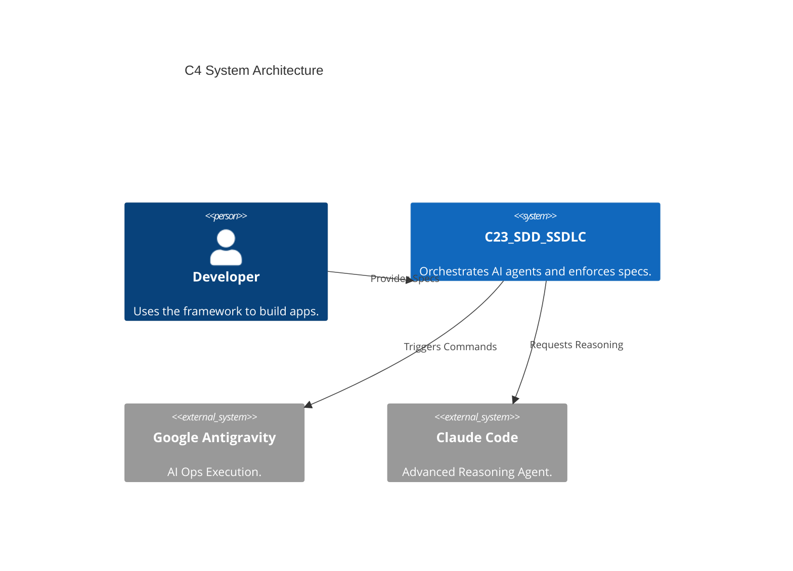

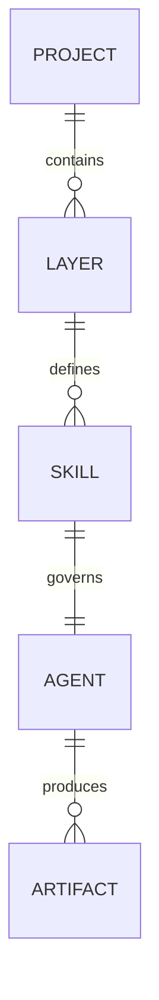

### 💻 LAYER 3: CODE (Standards & Guidelines)
Enforces "Senior Engineer" level code quality. Focuses on **PEP 484**, **SOLID** principles, and **Safe types**.

*   **Skill:** [`skill031_python_style.txt`](./.agents/skills/skill031_python_style.txt)
*   **Role:** Senior Engineer

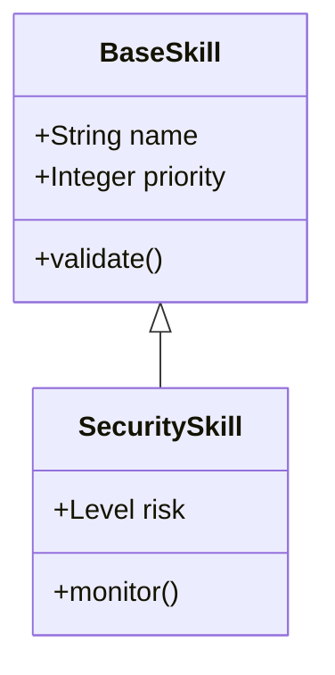

### 🏭 LAYER 4: IMPLEMENT (Development Specifics)
The actual implementation of Backend (FastAPI/Hono), Frontend (Next.js/HTMX), and Database (PostgreSQL/Prisma).

*   **Skills:**
    *   [`skill041_backend_spec.txt`](./.agents/skills/skill041_backend_spec.txt)
    *   [`skill042_db_schema.txt`](./.agents/skills/skill042_db_schema.txt)
    *   [`skill043_frontend_spec.txt`](./.agents/skills/skill043_frontend_spec.txt)
    *   [`skill044_ux_ui_MISTICA.txt`](./.agents/skills/skill044_ux_ui_MISTICA.txt)

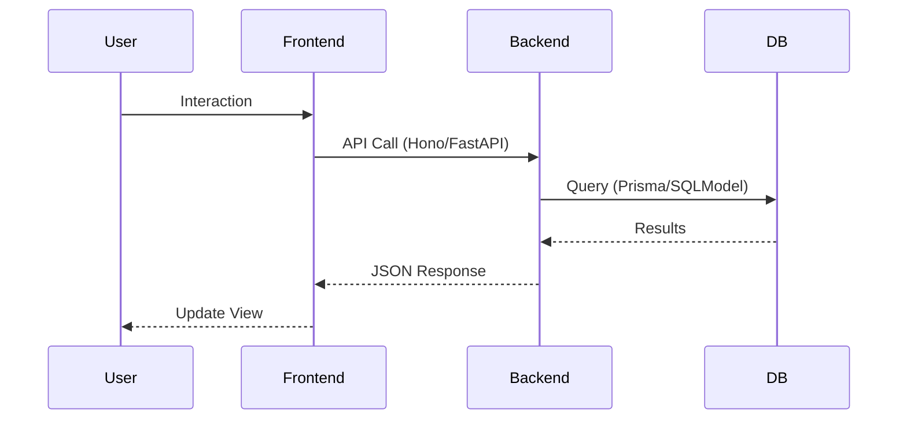

### 🧪 LAYER 5: QA & OPS
Focuses on testing (Pytest, Playwright) and Operating System tuning for Windows 11.

*   **Skills:**
    *   [`skill051_test_suite.txt`](./.agents/skills/skill051_test_suite.txt) (QA Lead)
    *   [`skill052_os_tuning.txt`](./.agents/skills/skill052_os_tuning.txt) (Ops Ninja)

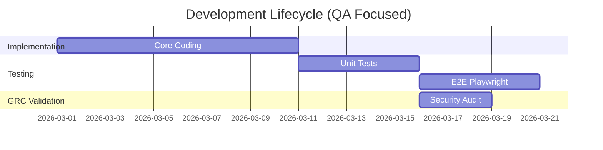

### 📚 LAYER 6: DOCS & DELIVERY
Automates the generation of documentation and project metadata.

*   **Skills:**
    *   [`skill061_readme.txt`](./.agents/skills/skill061_readme.txt)
    *   [`skill062_docs_engine.txt`](./.agents/skills/skill062_docs_engine.txt)
    *   [`skills063_docs_NATO_NCIA_RFI.txt`](./.agents/skills/skills063_docs_NATO_NCIA_RFI.txt)

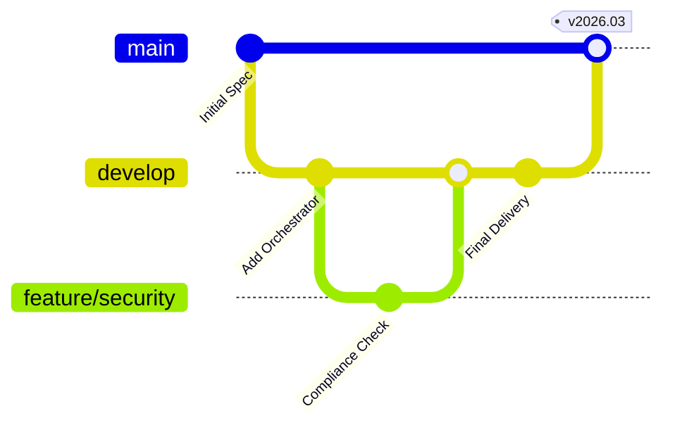

---

## 📊 4. Miscellaneous Framework Visualizations

```mermaid
sankey-beta
    "User Input" [100] --> "Orchestrator"
    "Orchestrator" [30] --> "Security Layer"
    "Orchestrator" [70] --> "Dev Layer"
    "Security Layer" [30] --> "Passed"
    "Dev Layer" [60] --> "Passed"
    "Dev Layer" [10] --> "Failed/Retry"
```

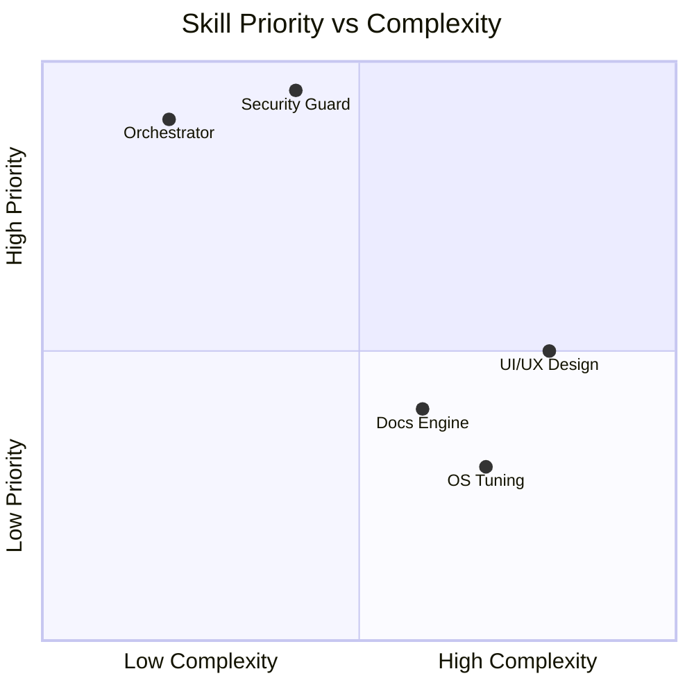

```mermaid
kanban
  Todo
    [ ] Integrity Check
    [ ] License Alignment
  In Progress
    [x] SDD Layer Mapping
  Done
    [x] Framework Renaming
```

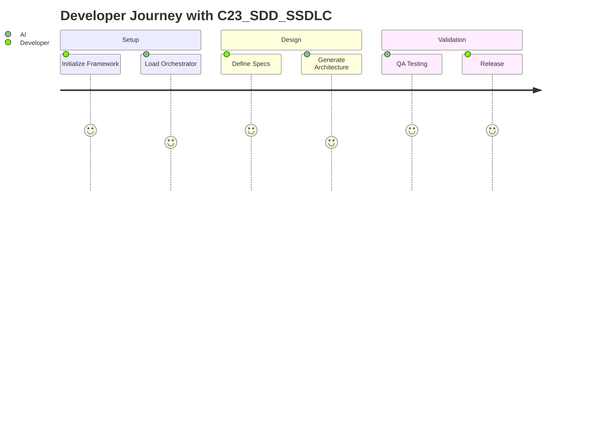

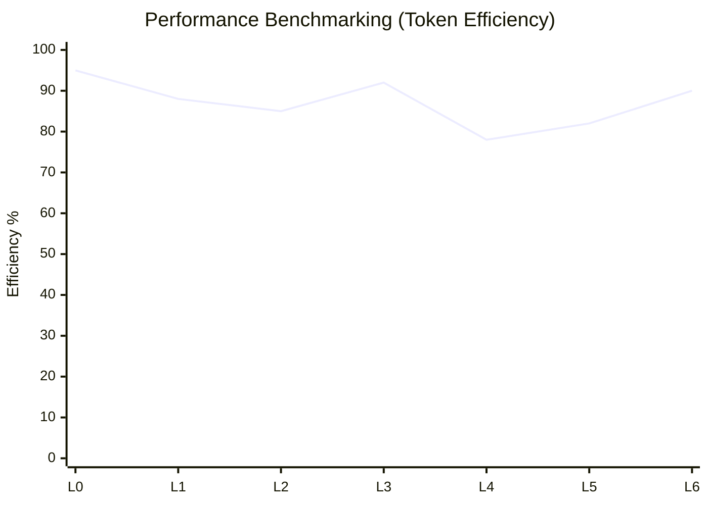

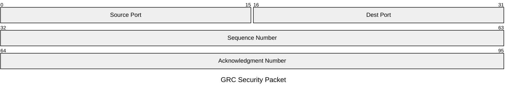

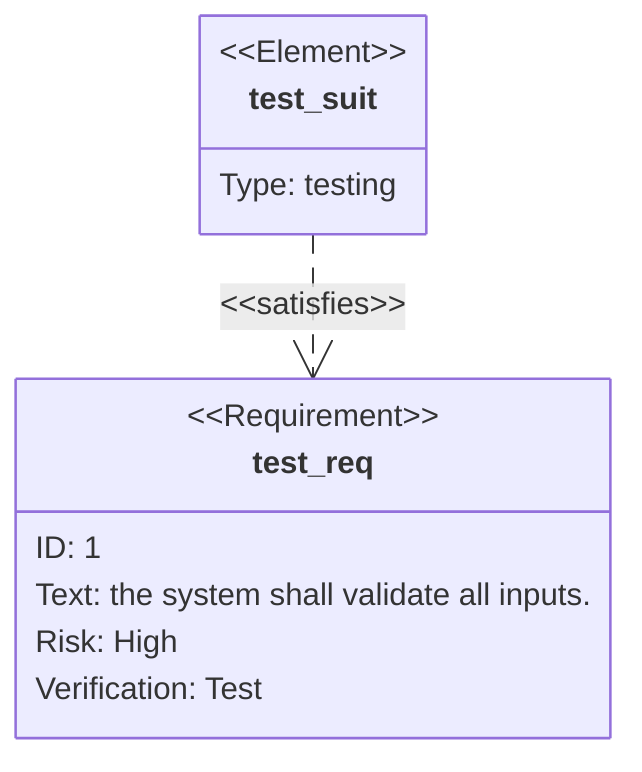

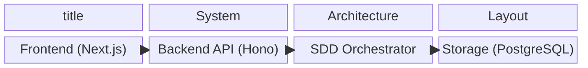

```mermaid
block-beta
  title Skill Hierarchy Treemap (Simulated)
  columns 8
  L0:4 L1:2 L2:2
  L3:3 L4:3 L5:2
  L6:8
```

```mermaid
zenuml
    title Skill Initialization
    Orchestrator -> Layer1: Request Compliance
    Layer1 -> SecuritySkill: Validate
    SecuritySkill -> Layer1: Done
    Layer1 -> Orchestrator: Approved
```

```mermaid
stateDiagram-v2
    [*] --> Idle
    Idle --> Processing: New Spec
    Processing --> Validating: Code Generated
    Validating --> Idle: Success
    Validating --> Processing: Failure (Re-prompt)
```

---

<div align="center">
  <i>Written in British Oxford English | Formatted with C23_SDD_SSDLC | AI Ops: Google Antigravity & Claude Code</i>
  <br/>
  <b>Last Update: March 2026</b>
</div>
